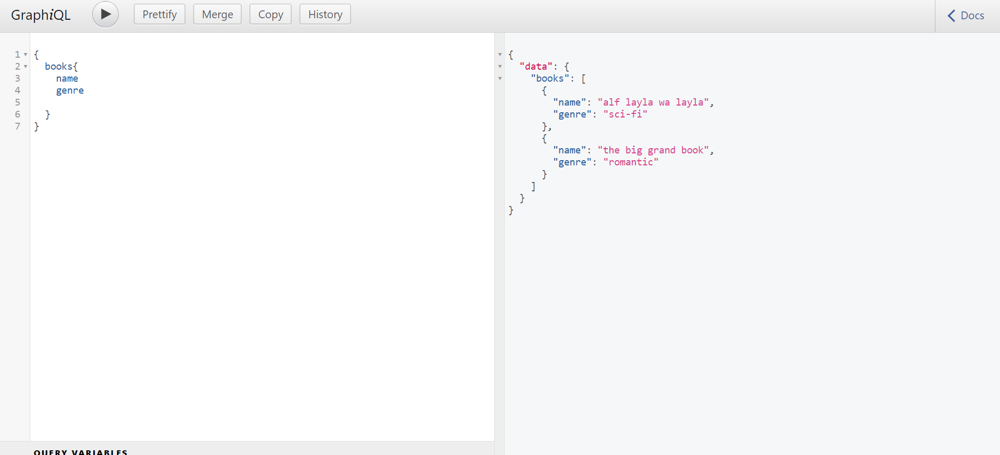
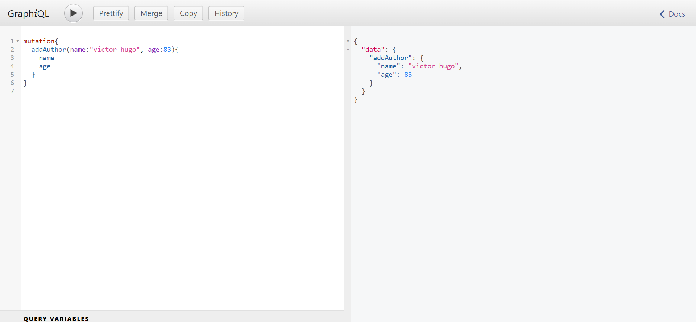

First,:

```bash
npm install
npm run dev

```
<p align="center">

</p>

This Books CRUD API is a backend solution that leverages GraphQL, Node.js, and Express to provide an efficient way to manage books data. This API utilizes MongoDB as the database and allows users to access books by their names, authors, and genres. Additionally, users can access authors by their names and ages.

Built with GraphQL, the Books CRUD API uses a query language that enables clients to specify the exact data they need. Clients can request books by providing the book's name, author name, or genre, and retrieve specific book details. Similarly, they can query authors by their names and ages to retrieve specific author information.

<p align="center">

</p>

With the Books CRUD API, users can easily create, read, update, and delete books using a clear and consistent API structure. They can retrieve books based on specific criteria such as name, author, or genre. The API also allows users to access author details, including their names and ages.